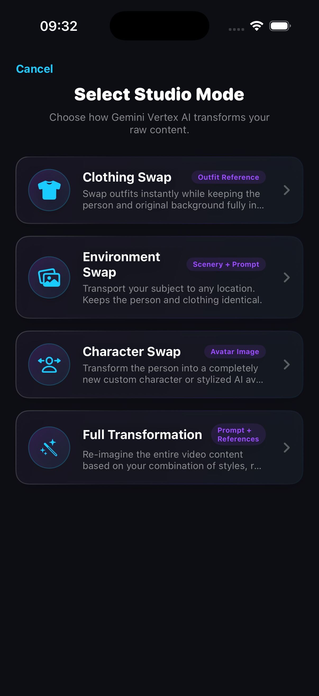
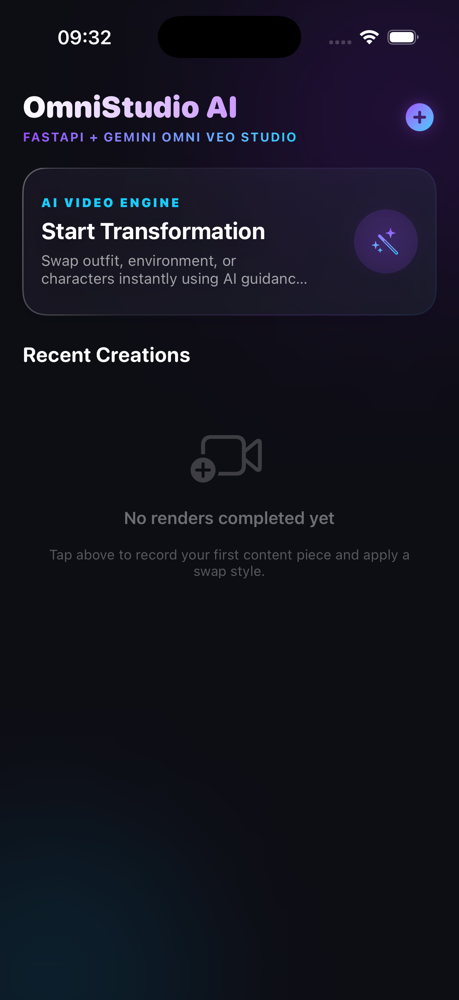
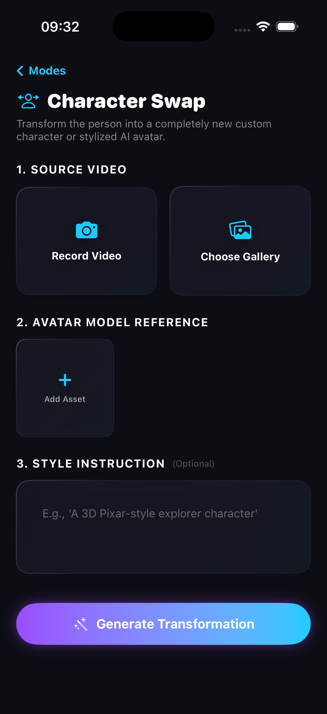

# Morph

**Morph** ist eine SwiftUI-basierte iOS-App für KI-gestützte Videotransformationen. Sie verbindet lokale Videoaufnahme, Medienauswahl und Style-Referenzen mit einem FastAPI-Backend, das AI-Transformationen über Gemini Vertex AI oder eine ähnliche Render-Pipeline ausführen kann.

## 🚀 Projektübersicht

Morph bietet einen stilvollen Studio-Workflow mit vier KI-Verarbeitungsmodi:

- **Clothing Swap** – tauscht Outfits bei gleichbleibender Person und Umgebung.
- **Environment Swap** – verändert die Umgebung, während Person und Kleidung erhalten bleiben.
- **Character Swap** – wandelt eine Person in einen neuen Charakter oder Avatar um.
- **Full Transformation** – erzeugt eine komplette Neugestaltung des Videos anhand von Referenzen und Prompt.

Die App unterstützt:

- lokale Videoaufnahme via Kamera
- Auswahl bestehender Videos aus der Medienbibliothek
- Auswahl von Referenzbildern für Stil, Kleidung oder Umgebung
- Freitext-Prompt für erweiterte AI-Anweisungen
- Live-Upload-Fortschritt und WebSocket-Streaming von Rendervorgängen
- Übersicht über vergangene Transformationen
- Vorher/Nachher-Vergleich und Teilen fertiger Ergebnisse

## 🎬 Demo Vorschau

*Modusauswahl mit vier KI-Transformationsvarianten.*

*Startseite mit Studio-Branding und Verlaufserstellung.*

*Workspace-Flow mit Videoquelle, Referenzen und Prompt-Eingabe.*

## 🧩 Architektur

### Frontend

- **SwiftUI** für komplette UI-Layouts
- **@Observable / Environment** für globalen App-State
- **PhotosUI** für Video- und Bilderauswahl
- **AVFoundation / AVKit** für Kameraaufnahme und Videowiedergabe
- **Async/Await** für Netzwerkaufrufe und asynchrone Verarbeitung

### Backend-Integration

- **`APIClient`**: Upload von Videodateien und Referenzbildern als Multipart/Form-Data
- **`WebSocketService`**: Live-Stream von Render-Fortschritten
- **`RenderTask`**: Standardisiertes Task-Modell mit Status, Fortschritt und URLs

### Zustand und Workflow

- **`AppStateManager`**
  - verwaltet aktuelle Verarbeitungsmodi
  - hält ausgewählte Medien und Referenzbilder
  - steuert Upload- und Render-Status
  - speichert Task-Historie lokal in `UserDefaults`

## 📁 Projektstruktur

- `Morph/MorphApp.swift` – App-Entry-Point
- `Morph/ContentView.swift` – Root-View mit Dashboard und Workspace-Modal
- `Morph/State/AppStateManager.swift` – zentrale App-Logik
- `Morph/Networking/APIClient.swift` – REST-Upload & API-Aufrufe
- `Morph/Networking/WebSocketService.swift` – WebSocket-Updates
- `Morph/Models/ProcessingMode.swift` – KI-Modi und Metadaten
- `Morph/Models/RenderTask.swift` – Task-Status und Ergebnisdaten
- `Morph/Views/` – UI-Bildschirme: Dashboard, Workspace, Result, Capture, Status

## ⚙️ Voraussetzungen

- Xcode 15+ / iOS 17+ (SwiftUI-Modernisierung mit `@Observable`)
- Ein FastAPI-Backend mit folgenden Endpunkten:
  - `POST /api/v1/transform`
  - `GET /api/v1/tasks/{taskId}`
  - `GET /api/v1/tasks/{taskId}/ws`
  - `GET /api/v1/tasks`

> Standardmäßig zeigt der Client auf `http://localhost:8000`. Passe `APIClient.shared.baseURLString` an, wenn dein Backend auf einer anderen Domain oder einem anderen Port läuft.

## 💻 Installation

1. Öffne `Morph.xcodeproj` in Xcode.
2. Stelle sicher, dass dein Zielgerät iOS 17 oder neuer verwendet.
3. Baue das Projekt mit `⌘B`.
4. Starte die App auf einem echten Gerät oder im Simulator.

## 🧪 Verwendung

1. Öffne die App und tippe auf **Start Transformation**.
2. Wähle einen Verarbeitungsmodus aus:
   - `Clothing Swap`
   - `Environment Swap`
   - `Character Swap`
   - `Full Transformation`
3. Lade ein Quellvideo hoch oder nimm eines auf.
4. Füge Referenzbilder hinzu, falls erforderlich.
5. Gib optional einen Prompt ein.
6. Tippe auf **Generate Transformation**, um den Upload zu starten.
7. Verfolge den Fortschritt in der Statusanzeige.
8. Sieh dir das Ergebnis an, wechsle zwischen vorher/nachher und teile es.

## 🔧 Anpassung

- Backend-URL: `Morph/Networking/APIClient.swift`
- Moduslogik: `Morph/Models/ProcessingMode.swift`
- Upload-Fortschritt: `Morph/State/AppStateManager.swift`
- UI-Styling: `Morph/Views/` und `Morph/Views/Components`

## 🧠 Hinweise

- Die App erwartet eine funktionierende AI-Rendering-Pipeline auf der Serverseite.
- Im Simulator wird die Kameraaufnahme durch ein Platzhalter-Video simuliert.
- Das Playback in `ResultPlaybackView` unterstützt sowohl lokale als auch entfernte Video-URLs.

## 📌 Empfehlung

Für eine vollständige Produktivstellung sollte das Backend mit sicherer Authentifizierung, robustem Fehlerhandling und einem Asset-Management für Ergebnisse erweitert werden.
